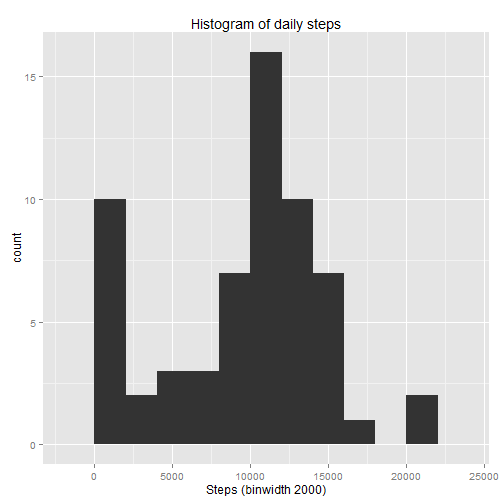

## Loading and preprocessing the data

```r
#Load the data (i.e. read.csv())
df <- read.csv("activity.csv")

#Process/transform the data (if necessary) into a format suitable for your analysis
df$date <- as.Date(df$date)
```


## What is mean total number of steps taken per day?

```r
#histogram of the total number of steps taken each day
library(ggplot2)
total.steps.by.day <- aggregate(x = df$steps , by = list(df$date), FUN = sum ,na.rm=TRUE)
names(total.steps.by.day) <- c("date","steps")
histplot <- ggplot(total.steps.by.day,aes(x = steps)) +
            ggtitle("Histogram of daily steps") +
            xlab("Steps (binwidth 2000)") +
            geom_histogram(binwidth = 2000)
histplot
```

 

```r
#mean total number of steps taken per day
mean(total.steps.by.day$steps , na.rm = TRUE)
```

```
## [1] 9354
```

```r
#median total number of steps taken per day
median(total.steps.by.day$steps , na.rm = TRUE)
```

```
## [1] 10395
```

## What is the average daily activity pattern?

```r
#Time series plot of 5-minute interval and the average number of steps taken, averaged across all days
average.steps.by.interval  <- aggregate(x = df$steps , by = list(df$interval), FUN = mean ,na.rm=TRUE)
names(average.steps.by.interval) <- c("interval","steps")

avg.step.line <- ggplot(average.steps.by.interval,aes(interval,steps)) +
                 ggtitle("Time Series Plot of Average Steps by Interval") +
                 geom_line()
avg.step.line  
```

 

```r
#The 5-min time interval contains the maximum number of steps?
average.steps.by.interval[which.max(average.steps.by.interval$steps),c("interval")]
```

```
## [1] 835
```


## Imputing missing values

```r
#total number of missing values in the dataset
nrow(df[is.na(df$steps),])
```

```
## [1] 2304
```

```r
#imputing missing step values with mean step at time interval
df.imputed <- merge(x = df, y = average.steps.by.interval, by = "interval", all.x = TRUE)
df.imputed[is.na(df.imputed$steps.x),c("steps.x")] <- df.imputed[is.na(df.imputed$steps.x),c("steps.y")]

#cleaning data
df.imputed$date <- as.Date(df.imputed$date)
df.imputed$date.x <- NULL
df.imputed$Group.1 <- NULL
df.imputed$steps <- df.imputed$steps.x
df.imputed$steps.x <- NULL
df.imputed$steps.y <- NULL

#histogram with new dataframe
total.steps.by.day <- aggregate(x = df.imputed$steps , by = list(df.imputed$date), FUN = sum ,na.rm=TRUE)
names(total.steps.by.day) <- c("date","steps")
histplot <- ggplot(total.steps.by.day,aes(x = steps)) +
            ggtitle("Histogram of daily steps after imputation") +
            xlab("Steps (binwidth 2000)") +
            geom_histogram(binwidth = 2000)
histplot 
```

 

```r
#mean total number of steps taken per day
mean(total.steps.by.day$steps , na.rm = TRUE)
```

```
## [1] 10766
```

```r
#median total number of steps taken per day
median(total.steps.by.day$steps , na.rm = TRUE)
```

```
## [1] 10766
```


## Are there differences in activity patterns between weekdays and weekends?

```r
#Factor variable with two levels indicating a weekday or weekend.
df.imputed$weekday <- as.factor(ifelse(weekdays(df.imputed$date) %in% c("Saturday","Sunday"), "Weekend", "Weekday")) 

average.steps.by.interval.and.weekday  <- aggregate(x = df.imputed$steps , 
                                                    by = list(df.imputed$interval,df.imputed$weekday), FUN = mean ,na.rm=TRUE)
names(average.steps.by.interval.and.weekday) <- c("interval","weekday","steps")

#panel time series plot of the 5-minute interval and the average number of steps taken 
#averaged across all weekday days or weekend days.
avg.step.line <- ggplot(average.steps.by.interval.and.weekday,aes(interval,steps)) +
                 ggtitle("Time Series Plot of Average Steps by Interval after Imputation") +
                 facet_grid(. ~ weekday) +
                 geom_line(size = 1)
avg.step.line  
```

 

